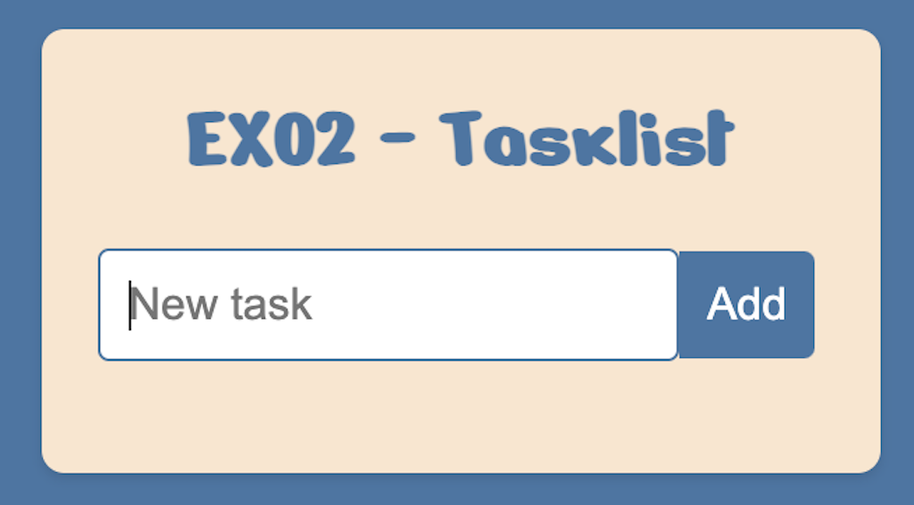
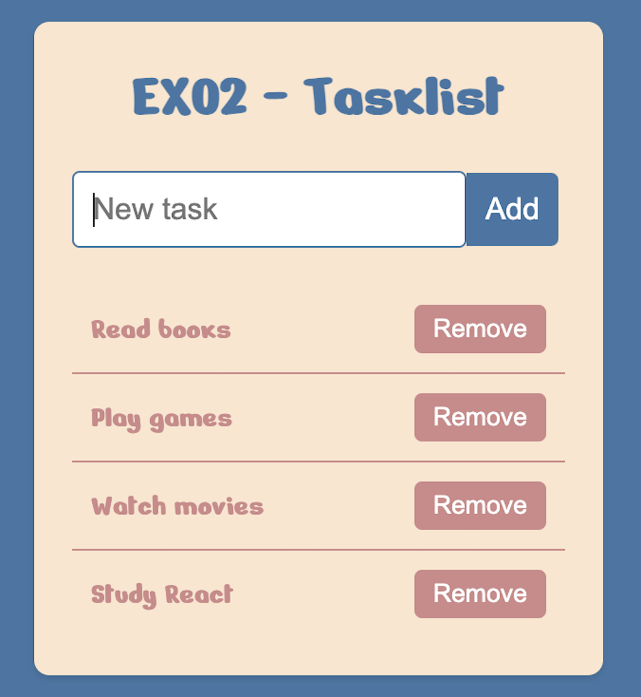
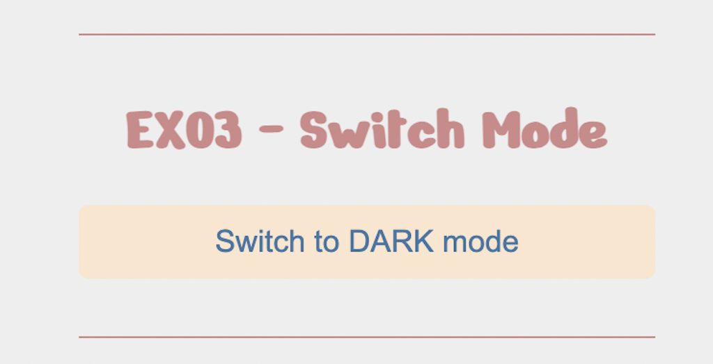
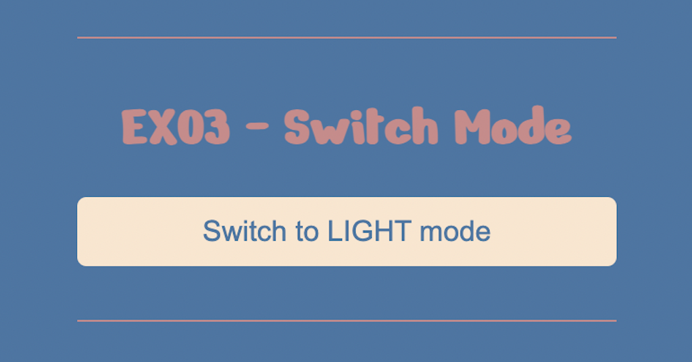
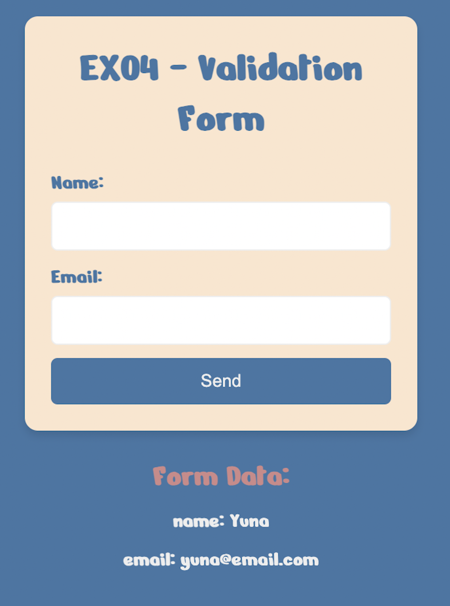
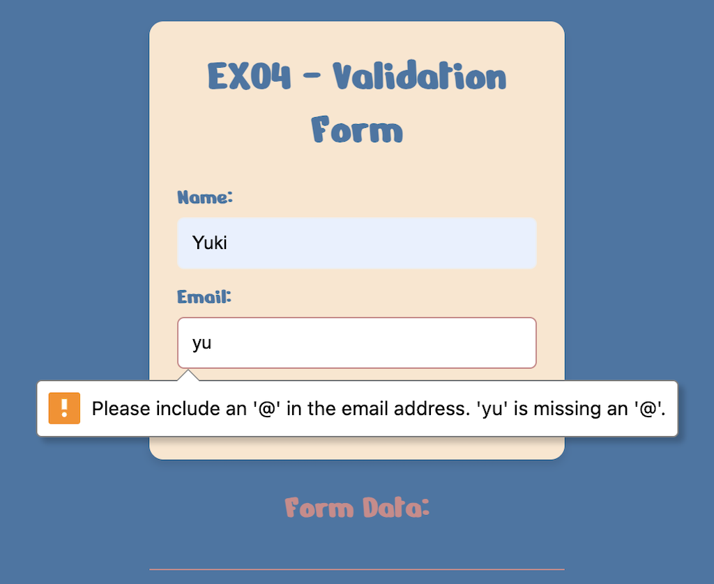
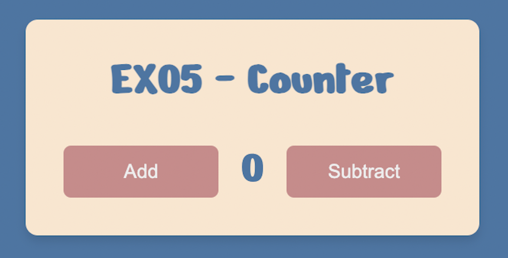
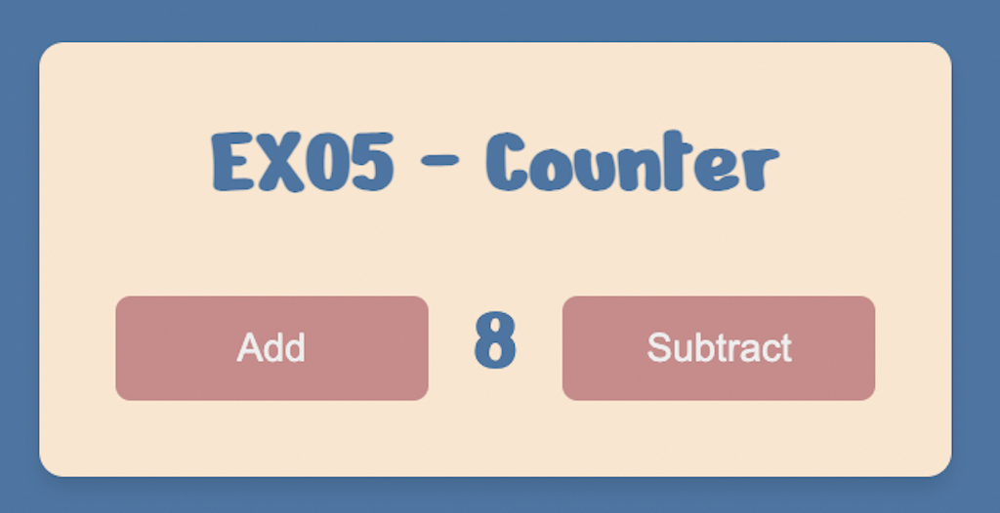
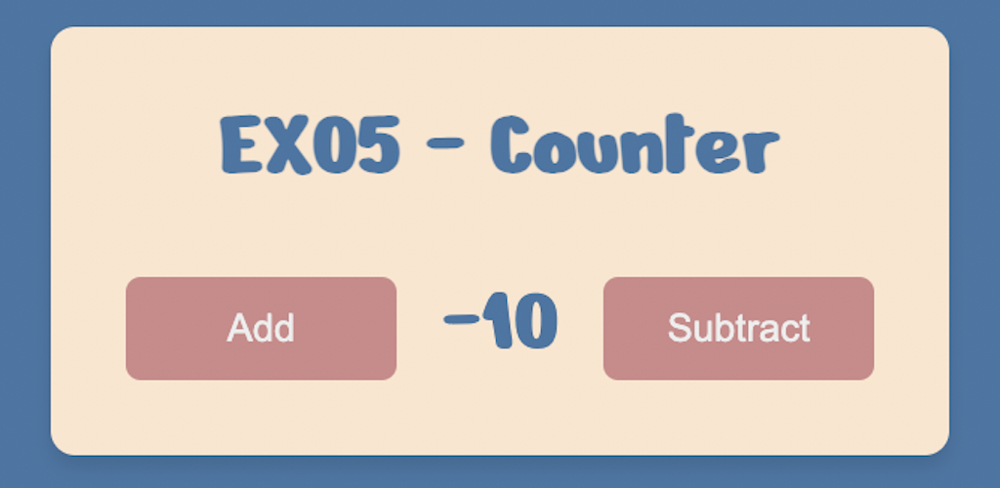

# M3S02

## React Review: 

Another week full of exercises with Vite and React for review purposes:

### EX01

#### Form with useForm
<h4 align="center"></h4>

### EX02

#### List to add and remove tasks with useState and useEffect
<h4 align="center"></h4>
<h4 align="center"></h4>

### EX03

#### Switch from LIGHT to DARK mode with context
<h4 align="center"></h4>
<h4 align="center"></h4>

### EX04

#### Validation Form
<h4 align="center"></h4>
<h4 align="center"></h4>

### EX05

#### Simple Counter
<h4 align="center"></h4>
<h4 align="center"></h4>
<h4 align="center"></h4>

---
### Technologies

- HTML
- CSS
- JavaScript
- React

### Libs

- React Hook Form